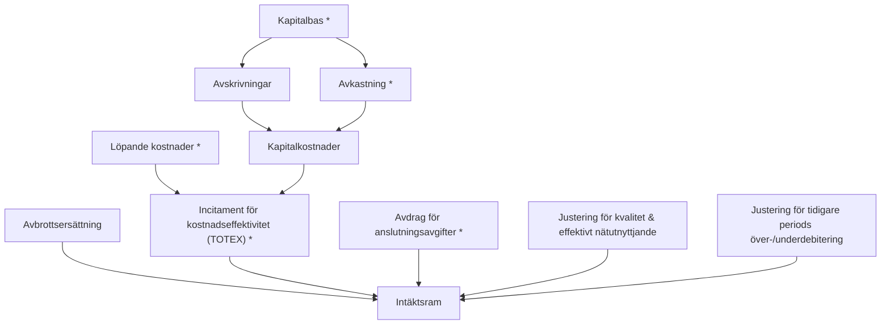

# Inriktning för reglering av elnätsföretagens intäktsramar 2028–2031

I presentationen beskrivs Ei:s inriktning för fastställande av elnätsföretagens intäktsramar för tillsynsperioden 2028–2031. De delar av metoden som Ei inte planerar att förändra beskrivs inte närmare. Ei önskar att berörda aktörer och intressenter lämnar skriftliga synpunkter på inriktningen senast den 15 september 2025 till forhandsreglering_el@ei.se.

## Innehåll

- Inledning
- Utvecklingsområden och tänkt inriktning
  - Kapitalbas
  - Kalkylränta
  - Anslutningsavgifter
  - Incitament för kostnadseffektivitet
- Avslutning
- Processen framåt

---

# Inledning

## Allmänt om reglering av elnät

- Elnät är monopol – ekonomisk reglering är nödvändig.
- EU-rätten ställer krav på förhandsprövning som syftar till att skapa en ökad förutsägbarhet för nätföretag och kunder.
- Sedan 2012 tillämpas därför en så kallad förhandsreglering som innebär att Ei inför varje tillsynsperiod (4 år) beslutar om intäktsramar för elnätsföretagen. Intäktsramen bestämmer hur stora intäkter nätföretaget får ha under tillsynsperioden.
- Kunderna ska betala ett skäligt pris samtidigt som nätföretagen får täckning för sina effektiva kostnader och en rimlig avkastning på det kapital som krävs för att driva verksamheten.
- Regleringen har utvecklats över tid, bl.a. som en följd av förändringar i regelverk och i omvärlden, utfall i domstolsprövningar samt på Ei:s initiativ.
- I dagsläget omfattas cirka 170 elnätsföretag av regleringen.

## En omfattande omställning av energisystemet pågår

- Energipolitiska mål i form av planeringsmål (300 TWh), leveranssäkerhetsmål, ökat fokus på beredskap m.m.
- Elektrifiering med förväntningar om kraftigt ökad efterfrågan på el de närmaste 20 åren.
- Delar av det befintliga elnätet behöver ersättas eller moderniseras.

## Regleringen tar sin utgångspunkt i EU-rätten och dess syften och mål

- De avgifter som tas ut av nätföretagen ska avspegla faktiska kostnader.
- Metoden för att beräkna avgifterna ska möjliggöra investeringar och ge incitament för den mest kostnadseffektiva driften av näten.
- Tillsynsmyndigheten ska skapa förutsägbara förutsättningar för de aktörer som berörs av myndighetens beslut.

## Mål med regleringen

- Kunderna ska betala ett skäligt pris för elnätstjänsten och ha en hög leveranssäkerhet.
- Regleringen ska vara förutsägbar och
  - avspegla nätföretagens effektiva kostnader,
  - möjliggöra nödvändiga investeringar,
  - ge företagen stabila och långsiktiga förutsättningar att driva och utveckla sina nät på ett kostnadseffektivt sätt.
- Regleringen blir därmed en möjliggörare för den pågående energiomställningen och elektrifieringen.

## Varför Ei gör en översyn av regleringen

- I Ei:s uppdrag ingår att kontinuerligt utvärdera och utveckla intäktsramsregleringen utifrån gällande lagstiftning och energimarknadens behov och förutsättningar.
- Ei har sedan flera år tillbaka identifierat att metoden för att fastställa elnätsföretagens intäktsramar behöver ses över för att bättre avspegla nätföretagens faktiska kostnader.
- Enligt förslag i betänkande SOU 2023:64 "Ett förändrat regelverk för framtidens el- och gasnät" ska Ei ta fram föreskrifter som i stor utsträckning ska ersätta lag och förordning.
- Förslaget har medfört ett intensifierat metodutvecklingsarbete, som inkluderar analys av hur väl den nuvarande metoden svarar mot EU-rättens syften och mål.
- Det är först när ny lagstiftning träder ikraft som Ei kan genomföra förändringar i metoden.

## Inspel och omvärldsbevakning

- Ei har kontinuerligt informerat om arbetet och vid flera tillfällen tagit emot synpunkter från berörda intressenter (stormöten med nätföretag och kunder, intressentgrupp för fördjupade diskussioner, bilaterala möten, etc.).
- Internationell utblick – Ei har inhämtat kunskap om hur andra tillsynsmyndigheter inom EU hanterar olika aspekter av regleringen.
- Underlagsrapporter från konsulter.
- Ei har tagit hänsyn till det underlag som inkommit eller inhämtats vid utformandet av metoden.

---

# Utvecklingsområden och inriktning

## Utvecklingsområden

Ei har identifierat fyra områden där Ei ser behov av att göra förändringar:

- Värdering av nätföretagens kapitalbas
- Kalkylräntan
- Hantering av anslutningsavgifter
- Incitament för kostnadseffektivitet

Nedan sammanfattas de förändringar Ei avser göra inom respektive utvecklingsområde. I efterföljande avsnitt beskrivs respektive område mer ingående.

## Figur: Intäktsramar elnät (utvecklingsområden markerade) — slide 13

Strukturdiagram över hur intäktsramen byggs upp. Pilarna anger flöde/bidrag. De markerade (blåfärgade) boxarna i originalet är de poster som berörs av utvecklingsområdena: **Kapitalbas**, **Avkastning** (kalkylränta), **Löpande kostnader**, **Incitament för kostnadseffektivitet (TOTEX)** och **Avdrag för anslutningsavgifter**. (De fyra formella utvecklingsområdena är kapitalbas, kalkylränta, anslutningsavgifter och incitament för kostnadseffektivitet.)

`*` = markerad i originalet (berörs av utvecklingsområde).

## Sammanfattning av inriktning (förändringar) — slide 14

Fyra oberoende kolumner i originalet (ingen radvis koppling mellan dem).

**Kapitalbasen**
- Kapitalbasen värderas utifrån en förmögenhetsbevarande princip till ursprungliga anskaffningsvärden för att bättre spegla faktiska kostnader och öka förutsägbarheten vid investeringar.
- Ingående kapitalbas värderas enligt en värdekonsistent metod, dvs befintliga anläggningar behåller värdet vid övergången till ny metod.
- Kapitalbasen prisjusteras med allmänt index (KPI) från och med beräkning av kapitalkostnaderna för första halvåret 2028.

**Kalkylräntan**
- Kalkylräntan beräknas även fortsättningsvis med WACC och CAPM.
- Kalkylräntan beräknas liksom tidigare som en real WACC.
- Åttaårig historik för att beräkna parametrarna för ökad förutsägbarhet.
- Parametrarna skattas innan tillsynsperioden som idag och ska inte uppdateras under eller efter tillsynsperioden.
- Beta-parametern och urvalskriterier för jämförelseföretagen är fortsatt under utredning.

**Anslutningsavgifter**
- Ett avdrag på intäktsramen görs för anläggningar vars investeringsutgifter täcks via anslutningsavgifter.
- Utgångspunkt för avdraget är inkomster från anslutningsavgifter.
- Beräkning av avdraget görs med samma kalkylränta och avskrivningstider som i kapitalkostnadsberäkningen.
- Börjar att gälla från och med tillsynsperioden 2028–2031.

**Incitament för kostnadseffektivitet**
- Målet är en TOTEX-lösning som ger rimlig kostnadspress och incitament till lösningsneutralitet, både för enskilda nätföretag och för branschen som helhet.
- Ambitionen är en lösning även för region- och transmissionsnät.
- Effekterna av incitamenten som syftar till att förbättra olika aspekter av kvalitet i nätet ska samspela med incitamentet för kostnadseffektivitet.

---

# Kapitalbas

## Värderingsprincip för kapitalbasen

- **Nuvarande hantering:** Anläggningarna marknadsvärderas enligt en kapacitetsbevarande princip.
- **Alternativ hantering:** Anläggningarna fortsätter att marknadsvärderas enligt en kapacitetsbevarande princip, men med korrigering för att eftersträva nettonuvärdesneutralitet.
- **Inriktning från och med tillsynsperioden 2028–2031:** Anläggningarna värderas enligt en förmögenhetsbevarande princip.

## Olika värderingsprinciper för kapitalbasen

- Värdet på de anläggningar som används i nätverksamheten (kapitalbasen) och nivån på den av Ei fastställda kalkylräntan har en central roll för nivån på kapitalkostnaderna (avskrivning och avkastning).
- För att bestämma värdet på kapitalbasen finns två huvudsakliga värderingsprinciper som i forskningslitteratur ofta benämns som förmögenhetsbevarande respektive kapacitetsbevarande princip. Metoderna har olika utgångspunkter:
  - Förmögenhetsbevarande princip – bygger på principen att nätföretaget får kostnadstäckning för de faktiska kostnaderna utifrån verkliga anskaffningsvärden för genomförda investeringar.
  - Kapacitetsbevarande princip – bygger på principen att nätföretagets anläggningar värderas till marknadsvärden som speglar vad det kostar att anskaffa motsvarande anläggningar idag.
- I Sverige tillämpas idag en kapacitetsbevarande princip vid värdering av kapitalbasen, dvs. anläggningarna marknadsvärderas. Båda metoderna tillämpas av tillsynsmyndigheter i Europa.

## Vad vill Ei uppnå?

- Ei strävar efter en värderingsprincip som ökar förutsägbarheten i regleringen och möjliggör nödvändiga investeringar.
- Ei strävar efter en värderingsprincip som avspeglar nätföretagens effektiva kostnader och som skapar skäliga priser för kunden.

## Nuvarande marknadsvärdering medför risk för över- eller underavkastning

- Marknadsvärderingen av nätföretagens anläggningar kan medföra att nivån på avkastningen både över- eller understiger den av Ei fastställda kalkylräntan. Orsaken är hur inflation hanteras för att ta hänsyn till förändringar i penningvärdet.
- För att marknadsvärdera elnätsföretagens anläggningar används i huvudsak en normvärdeslista som ska spegla investeringsutgifter som ett företag skulle ha på en konkurrensutsatt marknad. Förändringar i övrigt i prisläget för kapitalbasen ska motsvara ett sektorsspecifikt index.
- För att beräkna en rimlig avkastning för det kapital som krävs för att genomföra investeringar fastställer Ei en kalkylränta som tillämpas (beräknas) på de marknadsvärderade anläggningarna.
- Eftersom kapitalbasen nu är marknadsvärderad behöver den av Ei fastställda kalkylräntan vara real, dvs exklusive inflation (annars skulle kompensation ges för inflation två gånger, både i värdet för kapitalbasen och i kalkylräntan).
- För att beräkna en real kalkylränta används ett index som speglar ökningen av den allmänna prisnivån (allmänt index) för att räntan för investerare ska bli jämförbar med andra räntor på marknaden.
- Alltså används i nuvarande metod olika index för att marknadsvärdera anläggningarna och för att beräkna den reala kalkylräntan.

## Olika prisutveckling för sektorsspecifikt index och allmänt index

- Förutsatt att det allmänna indexet och prisutvecklingen av normvärden/sektorsspecifika indexet ligger på samma nivå över anläggningarnas livslängd kommer företagen få igen investeringsutgiften för anläggningen. Avkastningen för anläggningarna motsvarar då den av Ei fastställda kalkylräntan.
- I praktiken har dessa index skilt sig åt vilket skapar en osäkerhet kring nivån på avkastningen och minskar förutsägbarheten i den kapacitetsbevarande principen.
- Det kan leda till "spekulation" kring prisutvecklingen av normvärden/sektorsspecifikt index kontra allmänt index, då det får en direkt inverkan på avkastningen.
- Prisutvecklingen av normvärden och det sektorspecifika prisindexet som använts för att marknadsvärdera kapitalbasen har under lång tid överstigit det generella prisindexet som används för att beräkna den reala kalkylräntan. (Diagram i originalet, slide 22.)

## Behov att se över värderingsprincipen för kapitalbasen

- Om prisutvecklingen av normvärden/sektorsspecifika indexet i framtiden i stället understiger det allmänna indexet under en längre tid, skulle företagens avkastning vara lägre än den fastställda kalkylräntan. Det kan påverka investeringsviljan för framför allt nyare teknik som efter investeringstillfället kan genomgå en prisnedgång på grund av teknikutveckling.
- En sådan utveckling skulle vara problematisk och skulle behöva hanteras för att inte riskera att hämma de investeringar som behövs för att driva verksamheten.
- Risken för systematisk över- eller underavkastning i förhållande till den av Ei fastställda kalkylräntan behöver minska.
- Sedan den kapacitetsbevarande principen infördes har förutsättningarna för elnät förändrats. Från att ha befunnit oss i en förvaltande fas är vi nu i en energiomställning med stora förväntade investeringar i elnät.
- Utifrån ovanstående förutsättningar behöver värderingsprincipen för kapitalbasen utvärderas.

## Alternativ som analyserats (värderingsprincip)

- **Nuvarande hantering** – Nätföretagens anläggningar fortsätter att marknadsvärderas enligt den kapacitetsbevarande principen.
- **Alternativ hantering 1** – Ei fortsätter tillämpa kapacitetsbevarande princip med korrigering för att eftersträva nettonuvärdesneutralitet.
- **Alternativ hantering 2** – Nätföretagens anläggningar värderas enligt en förmögenhetsbevarande princip.

## Hantering enligt alternativ 1

- Att fortsätta tillämpa en kapacitetsbevarande princip men ändå eftersträva nettonuvärdesneutralitet kan göras genom att indexet för beräkning av en real kalkylränta anpassas till prisjusteringen av kapitalbasen.
- För att få en real kalkylränta behöver då ett sektorsspecifikt index användas.
- Det skulle dock innebära att kalkylräntan inte är jämförbar med andra räntor på marknaden.
- Kalkylräntan kommer då inte att spegla alternativkostnaden för kapital, vilket medför sämre förutsättningar och mindre transparens för investerare vid jämförelse av alternativa placeringar.
- Ei avser därför inte att tillämpa alternativ 1.

## Kriterier för utvärdering av värderingsprinciper

Följande kriterier har använts för att utvärdera en förmögenhetsbevarande värderingsprincip mot nuvarande kapacitetsbevarande princip:

- **Nettonuvärdesneutralitet** – Är ett sätt att mäta att företagen får igen vad investeringarna kostat, givet en viss kalkylränta. Om investeringen är nettonuvärdesneutral innebär det att avkastningen är lika stor som den av Ei fastställda kalkylräntan.
- **Nätföretagens (monopolistens) risk och investeringsbeteende** – Valet av värderingsprincip påverkar den risk som tas och därmed även investeringsbeteendet. Till exempel är risken lägre för företagen om värderingsprincipen är nettonuvärdesneutral.
- **Tillämpningskostnader (redovisningsstandard och informationskostnader)** – Valet av värderingsprincip kan innebära skillnader i vad som behöver rapporteras av nätföretaget till tillsynsmyndigheten. En värderingsprincip som innebär ett rapporteringskrav som överensstämmer med redovisningsstandard och praxis minskar risken för felrapporterade data samt minskar nätföretagens rapporteringskostnader.
- **Marknadskompatibilitet** – Innebär att anläggningarna marknadsvärderas och konkurrensneutralitet skapas mellan existerande och nya företag som vill etablera sig på marknaden. Annars skulle nya företag ha svårt att konkurrera mot gamla företag på grund av att investeringar är dyrare idag än historiskt. Då de svenska elnäten bedriver monopolverksamhet och det därmed saknas konkurrens är kriteriet inte relevant vid utvärderingen.

## Inriktning – Förmögenhetsbevarande princip

Den förmögenhetsbevarande principen uppfyller kriterierna bäst eftersom den:

- På ett bättre sätt avspeglar faktiska kostnader – principen uppfyller nettonuvärdesneutralitet, dvs ingen över- eller underavkastning i förhållande till den av Ei fastställda kalkylräntan.
- Ökar förutsägbarheten och minskar därmed risken för nätföretagen.
- Gynnar investeringar; investerare får behålla köpkraften i satsat kapital då avkastning följer den allmänna prisutvecklingen för att prisjustera kapitalbasen.
- Tillämpningskostnaderna blir lägre än i nuvarande värderingsprincip. Är mer konsistent med redovisningen och en omfattande normvärdeslista behöver inte tas fram.

## Hantering av ingående kapitalbas

Vid en övergång till en förmögenhetsbevarande princip behöver värdet på den ingående kapitalbasen fastställas. Med den ingående kapitalbasen avses den kapitalbas som rapporterades inför tillsynsperioden 2024–2027 inklusive investeringar och utrangeringar under den tillsynsperioden.

Tre metoder för att fastställa värdet:

- **Metodkonsistent metod** – Restvärdet för den ingående kapitalbasen beräknas som om en förmögenhetsbevarande princip tillämpats under anläggningarnas hela livslängd.
- **Värdekonsistent metod** – Utgår från restvärdet för den ingående kapitalbasen i nuvarande kapacitetsbevarande princip, dvs utgående värde för kapitalbasen reducerat med historiska ackumulerade avskrivningar vid metodbytet uttryckt i marknadsvärden.
- **Parallell metod** – Nuvarande kapacitetsbevarande princip används för befintliga anläggningar innan metodbytet tills de är fullt avskrivna. Förmögenhetsbevarande princip används för investeringar efter metodbytet.

### Jämförelse av de tre metoderna (slide 31)

**Metodkonsistent metod**
- EU-rättens krav på förhandsprövning syftar till att skapa ökad förutsägbarhet för nätföretag och kunder. Metoden tillgodoser inte kraven på förutsägbarhet och stabilitet.
- Bidrar inte till att skapa förutsättningar för att säkra framtida investeringar på grund av stor påverkan på värdet för den ingående kapitalbasen.
- Ei känner inte till att någon europeisk reglermyndighet har genomfört ett metodbyte med en metodkonsistent övergång.

**Värdekonsistent metod**
- Tillgodoser krav på förutsägbarhet och stabilitet då påverkan på redan genomförda investeringar begränsas (marknadsvärderingen till och med 2027 blir konserverad).
- Ger en infasning till ny värderingsprincip från och med metodbytet 2028 och eliminerar därmed risken för ytterligare systematisk över- eller underavkastning i förhållande till kalkylräntan.
- Skapar förutsättningar för att säkra framtida investeringar.

**Parallell metod**
- Tillgodoser krav på förutsägbarhet och stabilitet på grund av successiv övergång till ny metod.
- Marknadsvärderingen i nuvarande värderingsprincip fortsätter dock under hela livslängden för anläggningar som fanns innan metodbytet 2028.
- Marknadsvärderingen kommer därmed fortsätta under mycket lång tid då anläggningarna i kapitalbasen vid beräkning av intäktsramen har en avskrivningstid på upp till 75 år (inklusive successiv revideringskomponent).
- Innebär att två separata beräkningsmetoder behöver administreras under mycket lång tid.
- Skapar förutsättningar för att säkra framtida investeringar.

## Inriktning – Värdekonsistent metod

- Både värdekonsistent och parallell metod tillgodoser kraven på förutsägbarhet och stabilitet och bidrar därmed till att skapa förutsättningar för framtida investeringar. Metoderna har tillämpats av andra medlemsstater vid metodbyten. Den metodkonsistenta övergångsmetoden tillgodoser inte kraven på förutsägbarhet och stabilitet och riskerar att skapa mer osäkra förutsättningar för framtida investeringar.
- Ei avser att tillämpa en värdekonsistent metod eftersom:
  - En infasning av en förmögenhetsbevarande princip eliminerar risken för ytterligare systematisk över- eller underavkastning i förhållande till den av Ei fastställda kalkylräntan från metodbytet och framåt.
  - Medför under mycket lång tid lägre administrativa kostnader än den parallella metoden.
- Befintliga anläggningar behåller därmed värdet de har i nuvarande metod vid övergången till en förmögenhetsbevarande princip tillsynsperioden 2028–2031.
- Anläggningar som anskaffats från och med tillsynsperioden 2028–2031 ska värderas med ursprungligt anskaffningsvärde enligt den förmögenhetsbevarande principen.

## Kapitalkostnadsmetod – real eller nominell

- **Nuvarande/val:** Real kapitalkostnadsmetod vs. nominell kapitalkostnadsmetod.
- I en real kapitalkostnadsmetod används en real kalkylränta för att beräkna kapitalkostnaderna (inflation ingår inte i kalkylräntan).
- I en nominell kapitalkostnadsmetod används en nominell kalkylränta (inflation ingår i kalkylräntan).
- Både real och nominell kapitalkostnadsmetod utgår i den förmögenhetsbevarande principen från allmän inflation.

### Jämförelse real vs. nominell (slide 35)

**Real**
- Mindre risk för generationsbetalningar, dvs att en generation får betala mer än en senare generation som nyttjar samma anläggningar.
- Mer stabil metod vid högre nivåer på kalkylränta, inflation, investeringspucklar, företag med fåtal anläggningar.
- Bättre förutsättningar för benchmarking och jämförbarhet.

**Nominell**
- Enklare att förstå och tillämpa, bättre koppling och jämförbarhet med andra verksamheter.
- Andra alternativa avkastningar är i nominella termer.
- Kapitalbasen speglar bättre bokförda värden i den externa redovisningen.

## Inriktning – Real kapitalkostnadsmetod

- En real kapitalkostnadsmetod ska tillämpas då den framför allt är mer stabil än den nominella.
- Första gången kapitalbasen ska prisjusteras med allmänt index är vid beräkning av kapitalkostnaderna för första halvåret 2028 (tillsynsperiod 2028–2031).

## Real kapitalkostnadsmetod – allmänt index för inflation är KPI

- För att sträva mot nettonuvärdesneutralitet bör samma inflationsparameter användas för att exkludera inflation från den av Ei fastställda kalkylräntan som för att prisjustera kapitalbasen med ett allmänt index.
- Tidigare har KPIF (konsumentprisindex med fast ränta) använts för att konvertera nominell kalkylränta till en real kalkylränta.
- KPIF beräknas med samma data och på samma sätt som KPI (konsumentprisindex), men effekten av ändrade bostadsräntor räknas bort.
- KPI är det vanliga måttet för kompensations- och inflationsberäkningar i Sverige. Ei anser därför att KPI ska användas som inflationsmått.

## Sammanfattning inriktning – Kapitalbasen

- Kapitalbasen värderas utifrån en förmögenhetsbevarande princip till ursprungliga anskaffningsvärden.
  - Den ingående kapitalbasen värderas enligt en värdekonsistent metod, dvs anläggningarna behåller värdet de har i nuvarande kapacitetsbevarande princip vid övergången.
  - Anläggningar som anskaffas från och med 2028 värderas med ursprungligt anskaffningsvärde.
  - En real kapitalkostnadsmetod ska tillämpas och kapitalbasen ska prisjusteras med allmänt index (KPI) i stället för sektorsspecifikt index från och med beräkning av kapitalkostnaderna för första halvåret 2028.
- Förändringarna bidrar till att öka förutsägbarheten i regleringen och möjliggör nödvändiga investeringar, samtidigt som påverkan på redan genomförda investeringar begränsas.
- Med ovanstående förändringar anser Ei att priserna för kunden blir mer skäliga och bättre speglar nätföretagens effektiva kostnader.

---

# Kalkylränta

## Bakgrund och problemformulering

- Metoden för att beräkna kalkylräntan är idag komplicerad.
- Metoden är känslig för beräkningstidpunkt.
- Det finns en inkonsekvent hantering av tidsperspektivet för vissa parametrar.
- Metoden är känslig för vilka jämförelseföretag som inkluderas.

## Vad vill Ei uppnå?

- En teoretiskt vedertagen metod för att beräkna kalkylräntan som också är tillämpbar i regleringskontexten.
- Stabilitet och långsiktighet för nätföretag och kunder.
- En metod som anpassar sig efter marknadens förutsättningar, men där förutsägbarhet och stabilitet är viktigare än kortsiktiga marknadsrörelser.

## Kriterier för metoden

Det finns olika metoder för att beräkna kostnaden för kapital. Metoden som Ei tillämpar ska så långt det är möjligt:

- Bidra till de mål som finns för hela regleringen
- Vara transparent
- Minimera antalet egna bedömningar
- Ge konsekventa resultat
- Vara robust
- Vara så enkel som möjligt
- Kunna replikeras av andra
- Följa relevanta regelverk

## Metod för att beräkna kalkylränta

- **Nuvarande hantering:** WACC och CAPM.
- **Alternativ hantering:** Riskpremiemetoden.

### WACC och CAPM, ursprungliga former (slide 45)

$$WACC = R_D(1-T)\cdot\frac{D}{D+E} + R_E\cdot\frac{E}{D+E}$$

$$\text{CAPM:}\quad R_E = R_F + \beta_E\,(R_M - R_F)$$

Variabeldefinitioner:
- $R_D$ = kostnad för lånat kapital
- $R_E$ = kostnad för eget kapital (efter skatt i WACC)
- $T$ = skattesats
- $D$ = företagets finansiella skulder (marknadsvärderat)
- $E$ = företagets eget kapital (marknadsvärderat, vanligtvis mätt genom börsvärde)
- $R_F$ = riskfri ränta
- $R_M$ = förväntad avkastning på aktiemarknaden
- $\beta_E$ = betavärde, aktiebeta

(WACC = Weighted Average Cost of Capital; CAPM = Capital Asset Pricing Model.)

## Andra metoder som har analyserats

- Exempelvis Fama French (FF3 & FF5), Arbitrage Pricing Theory (APT), Dividend Capitalization Model (DCM), Discounted Cash Flow model (DCF):
  - Metoderna minskar inte/löser inte de utmaningar Ei ser med dagens metodik.
  - Tillför ytterligare komplexitet.
- Riskpremiemetoden:
  - Inte teoretisk förankrad.
  - Sällan använd av andra reglermyndigheter.
  - Subjektiva bedömningar krävs.

## Inriktning – WACC & CAPM

- Väletablerade metoder som har använts under lång tid och är välkända för aktörerna.
- Används av majoriteten av reglermyndigheterna inom Europa.
- Underlagsrapporter framtagna av externa konsulter stöder användning av WACC och CAPM.
- **Inriktning:** WACC och CAPM, men utveckla dagens metodik för att minska de utmaningar Ei identifierat.

## Real eller nominell kalkylränta

- **Nuvarande hantering:** Real kalkylränta. **Alternativ:** Nominell kalkylränta.
- Intäktsramen behöver ge täckning för samhällets prisutveckling (inflation). Denna kompensation kan antingen ges i kapitalbasen eller i kalkylräntan.
- Om inflationskompensation ges i kalkylräntan ska kalkylräntan vara nominell; om den ges i kapitalbasen ska kalkylräntan vara real.

## Inriktning – Real kalkylränta

- Kalkylräntan kommer att beräknas realt.
- Ei avser kommunicera en nominell och real kalkylränta för att göra det lättare att jämföra med andra nominella avkastningskrav i samhället och hos andra tillsynsmyndigheter.
- För att i så hög grad som möjligt uppnå nettonuvärdesneutralitet bör samma inflationsindex användas vid omvandling av nominell kalkylränta till real som vid indexering av kapitalbasen.
  - Då kapitalbasen ska inflationsjusteras med KPI bör KPI även användas för att omvandla den nominella kalkylräntan till real.

## Tidsperspektiv

- **Nuvarande hantering:** Mix prognos/scenario och historik. **Inriktning:** Skattning av parametrar utifrån historik.
- När parametrarna i kalkylräntan skattas måste beräkningarna baseras på data – historiska tidsserier och/eller framtida prognoser/scenarier.
- Det saknas prognoser/scenarier för att skatta alla parametrar som krävs enligt WACC och CAPM. I praktiken måste då en mix av prognoser/scenarier och historiska tidsserier användas, eller endast historiska tidsserier.
- Idag skattas parametrarna med en mix: riskfri ränta och inflation skattas med prognoser/scenarier (Konjunkturinstitutets prognoser/scenarier av 10-åriga svenska statsobligationer respektive KPIF).
- Prognoser och scenarier bygger på bedömningar och antaganden av framtiden och är förknippade med stor osäkerhet.

### Alternativ som analyserats – tidsperspektiv (slide 52)

**Nuvarande hantering: Mix av prognos/scenarier och historik**
- Fördelar: Framtida marknadsförhållanden kan uppskattas genom prognoser på vissa parametrar vilket kan ge bra förutsättningar för förväntad expansion.
- Nackdelar: Inkonsekvent hantering av parametrarna; känslig för vilken prognos som används; risk för felkompensation (över/under); utvecklingen i scenarier behöver inte visa den mest sannolika utvecklingen.

**Alternativ hantering: Historik på parametrar**
- Fördelar: Faktiska marknadsförutsättningar påverkar kalkylräntan, ökar förutsägbarheten; konsekvent hantering av parametrar; lämplig och förenlig med en förmögenhetsbevarande kapitalbasvärderingsmetod; vanligast bland reglerare i Europa.
- Nackdelar: Skattesatsen inte lämplig att ha historik på; öppnar för fler tänkbara historiska tidsintervall.

## Inriktning – Parametrar skattas med ett historiskt perspektiv

- Ett historiskt tidsperspektiv ökar förutsägbarheten då aktörerna vet vilken data som kommer att användas.
- Ett historiskt tidsperspektiv används av majoriteten av tillsynsmyndigheter för el- och gasnät i Europa.
- Olika tidsperspektiv innebär att metoden blir inkonsekvent och riskerar att leda till under- och överavkastning för företagen och oskäliga nätavgifter för kunderna.
- Prognoser är förknippade med osäkerhet (t.ex. har KI:s nioåriga prognoser historiskt tenderat att överskatta nivån för den riskfria räntan baserat på tioåriga statsobligationer).

## Tidsperiod

- **Nuvarande hantering:** 9 år. **Alternativ:** ≤4 år; 60 års historik. **Inriktning:** 5–10 år.
- Tidsperiod syftar till hur många år av historisk data som ska användas vid beräkningar för de enskilda parametrarna som ingår i kalkylräntan.
- Parametrarna kan skattas med relativt få år för att i högre utsträckning fånga aktuella marknadsförutsättningar, alternativt en längre tidsperiod för högre stabilitet i skattningarna.
- På grund av teoretiska samband mellan parametrarna kommer Ei använda samma tidsperiod för parametrarna. Detta bidrar även till att minska komplexiteten och antalet egna bedömningar.

### Alternativ som analyserats – tidsperiod (slide 56)

**Tidsperiod: 9 år (nuvarande)**
- Fördelar: Ökad förutsägbarhet; stabilare nivå på parametrar mellan tillsynsperioder; fångar in en konjunkturcykel.
- Nackdelar: Strukturella ändringar i beta kan inkluderas och eventuellt medföra en felaktig risknivå; eftersläpning vid (snabba) marknadsförändringar.

**Tidsperiod: ≤4 år**
- Fördelar: Fångar marknadens rörelser; mer likt en konkurrensutsatt marknad; speglar företagens investeringsförhållanden bättre under tillsynsperioden.
- Nackdelar: Mer volatilt, nivån på parametrarna varierar mer; riskerar att leda till mer volatila nätavgifter.

**Tidsperiod: 5–10 år**
- Fördelar: Ökad förutsägbarhet; stabilare nivå på parametrar mellan tillsynsperioder; fångar in en konjunkturcykel.
- Nackdelar: Strukturella ändringar i beta kan inkluderas och eventuellt medföra en felaktig risknivå; eftersläpning vid (snabba) marknadsförändringar.

**Tidsperiod: 60 år**
- Fördelar: Stabilitet.
- Nackdelar: Betavärden kan inte beräknas med jämförelseföretag då det saknas så långa dataserier; strukturella ändringar i risknivån inkluderas; aktiemarknadsriskpremien kan inte beräknas utifrån svensk data; ovanlig hantering av riskfri ränta internationellt.

## Inriktning – En åttaårig tidsperiod

- Åtta år motsvarar två tillsynsperioder.
- Ger en kalkylränta som fångar marknadens förutsättningar, men där förutsägbarhet och stabilitet är viktigare än kortsiktiga marknadsrörelser.
- En längre tidsperiod skapar mer förutsägbarhet och långsiktighet när kortsiktiga svängningar inte får lika stor påverkan på nivån på parametrar.
- Eftersom kalkylräntan sätts för en fyraårsperiod bör enstaka extremvärden inte få påverka nivån kraftigt, vilket en tidsperiod som fångar en konjunkturcykel undviker.

## Uppdatering av parametrar

- **Nuvarande hantering:** Ingen uppdatering av parametrar. **Alternativ:** Uppdatering av vissa parametrar; uppdatering av alla parametrar.
- Med nuvarande hantering skattas parametervärdena innan tillsynsperioden och ändras inte under perioden.
- Ett alternativ är att uppdatera dataserierna under eller efter tillsynsperioden, oavsett om tidsserierna baseras på historik eller prognoser/scenarier.
- Att uppdatera parametrar innebär att de skattade parametervärdena inte är samma under tillsynsperioden utan uppdateras vid en bestämd tidpunkt.

### Alternativ som analyserats – uppdatering av parametrar (slide 60)

**Inte uppdatera (nuvarande)**
- Fördelar: Nivån på kalkylräntan är känd i förväg; konsekvent hantering av alla parametrar; minskar osäkerhet; förenklar; förutsägbarhet för företag och kunder.
- Nackdelar: Förändringar i marknadsförhållanden tas inte hänsyn till inom en tillsynsperiod.

**Uppdatera vissa parametrar**
- Fördelar: Marknadsförutsättningar under tillsynsperioden inkluderas; minskad eftersläpning; liknar mer en konkurrensutsatt marknad.
- Nackdelar: Minskad förutsägbarhet kring nivåer på parametrar och avkastning; ökar komplexiteten; försvårar planering för nätföretag; kan leda till mer volatilitet i parameternivåer.

**Uppdatera alla parametrar**
- Fördelar: Marknadsförutsättningar under tillsynsperioden inkluderas efter perioden; konsekvent hantering av alla parametrar; minskad eftersläpning; liknar mer en konkurrensutsatt marknad.
- Nackdelar: Minskad förutsägbarhet av nivån på kalkylräntan; ökar komplexiteten; onödigt då vissa parametrar är stabila över tid.

## Inriktning – Ingen uppdatering av parametrar

- Parametrarna fastställs inför varje tillsynsperiod och ska därefter inte uppdateras.
- Att fastställa parametrar inför tillsynsperioden skapar stabilitet och förutsägbarhet för både företag och kunder.

## Enskilda parametrar

- **Skattesats** – dagens (förväntade) svenska bolagsskattesats under tillsynsperioden.
- **Riskfri ränta** – svenska statsobligationer, tioårig löptid.
- **Aktiemarknadsriskpremie** – PwC:s marknadsriskstudie.
- **Kreditriskpremie** – skillnad mellan index och tyska statsobligationsräntan.
- **Inflation** – KPI används som index. Då kapitalbasen kommer att inflationsjusteras med KPI bör KPI även användas för att omvandla den nominella kalkylräntan till real för att öka nettonuvärdesneutraliteten.
- **Skuldandel** – optimal skuldandel på 50 % för att skapa stabilitet och förutsägbarhet. Baserad på benchmarking utifrån övriga europeiska reglermyndigheter och jämförelseföretag.

## Sammanfattning av inriktning – Kalkylräntan

**Huvuddragen i metoden**
- WACC & CAPM (ingen förändring)
- Åttaårig historik för att beräkna parametrarna
- Real kalkylränta (ingen förändring)
- Parametrar uppdateras inte under eller efter tillsynsperioden (ingen förändring)

**Enskilda parametrar**
- Skattesats – dagens (förväntade) svenska bolagsskattesats under tillsynsperioden (ingen förändring)
- Riskfri ränta – svenska statsobligationer, tioårig löptid (ingen förändring)
- Aktiemarknadsriskpremie – PwC:s marknadsriskstudie (ingen förändring)
- Kreditriskpremie – skillnad mellan index och tyska statsobligationsräntan (ingen förändring)
- Inflation – KPI
- Skuldandel – 50 %

## Fortsatt under utredning (kalkylränta)

- Jämförelseföretag – urvalskriterier
- Beta-parametern

Ei planerar att kommunicera inriktningar i dessa delar under hösten.

---

# Anslutningsavgifter

## Inriktning (översikt)

- **Nuvarande hantering:** Avkastning ges för anläggningar vars investeringsutgifter täckts av anslutningsavgifter.
- **Inriktning:** Avkastning från anläggningar vars investeringsutgifter täcks av anslutningsavgifter dras av från intäktsramen.

## Om anslutningsplikt och anslutningsavgift

- Elnätsföretagen har anslutningsplikt:
  - Nätföretagen ska på objektiva, icke-diskriminerande och i övrigt skäliga villkor ansluta en elektrisk anläggning till ledningen eller ledningsnätet. Avsteg får göras om det saknas ledig kapacitet och inte finns förutsättningar att åtgärda kapacitetsbristen på ett samhällsekonomiskt motiverat sätt utan att förstärka ledningen, eller om det finns andra särskilda skäl.
- Elnätsföretagen har enligt ellagen rätt att ta ut en avgift för att ansluta en kund till elnätet. Anslutningsavgiften täcker hela eller delar av den investering som nätföretaget gör för att kunna överföra el till den nya kunden.
  - Anslutningsavgiften ska utformas så att nätföretagets skäliga kostnader för anslutningen täcks. Anslutningspunktens geografiska läge och den avtalade effekten i anslutningspunkten ska särskilt beaktas.
- Ei arbetar för närvarande med att ta fram föreskrifter om utformningen av anslutningsavgifter.

## Nuvarande hantering av anslutningsavgifter i intäktsramsregleringen

- Alla anläggningar som används i nätverksamheten ingår i kapitalbasen och genererar därmed kapitalkostnader som ingår vid beräkning av intäktsramar inför tillsynsperioden.
- Hänsyn till anslutningsavgifter tas först vid avstämningen av intäkterna i förhållande till den omprövade intäktsramen efter tillsynsperioden:
  - Intäktsförda anslutningsavgifter ingår bland de intäkter som stäms av mot intäktsramar.
  - Utrymmet för uttag av överföringsavgifter minskar.
- Uppgifter om intäktsförda anslutningsavgifter hämtas från elnätsföretagens årsrapporter. Redovisningen beror på vilken redovisningsprincip företagen tillämpar. Inkomst från en anslutningsavgift kan:
  - antingen intäktsföras direkt i sin helhet, eller
  - redovisas som en intäkt över ett antal år (periodiseras).
- De elnätsföretag som ansökt om och fått en reglermässig periodisering beviljad hanteras i särskild ordning. I de fallen skiljer sig uppgifter som tas upp i regleringen från de uppgifter som företagen redovisar i sina årsrapporter.

## Nuvarande hantering avspeglar inte nätföretagens kostnader

- I regleringen ges avkastning för anläggningar vars investeringsutgifter helt eller delvis täckts av anslutningsavgifter.
  - Nätföretagen behöver inte satsa kapital för den del av investeringen som täcks av anslutningsavgifter. Nuvarande reglering leder därmed till att nätföretagens kostnader inte avspeglas i intäktsramen, vilket kan leda till att kunderna betalar oskäliga nätavgifter.
- En nyanslutning ger olika effekter beroende på företagets redovisningsprinciper och om företaget fått reglermässig periodisering beviljad. Detta kan leda till volatila nätavgifter eller att intäktsförda anslutningsavgifter inte är i samma prisnivå som intäktsramen de stäms av mot.

## Vad vill Ei uppnå?

- Ersättning som avspeglar nätföretagets kostnader och inte kan leda till att kunderna betalar oskäliga nätavgifter.
- Samma effekt för samtliga nätföretag. Företagens redovisningsprinciper och eventuella beslut om reglermässig periodisering ska inte påverka utfallet i regleringen.

## Alternativ som analyserats (anslutningsavgifter)

**Nuvarande hantering**
- Avkastning ges även för anläggningar vars investeringsutgifter helt eller delvis täckts av anslutningsavgifter.
- Hanteringen avspeglar därmed inte företagets kostnader och kan leda till att kunderna betalar oskäliga nätavgifter. En nyanslutning ger dessutom olika effekter för olika företag beroende på redovisningsprincip och om reglermässig periodisering beviljats.

**Alternativ hantering**
- Avkastning ges inte för anläggningar/delar av anläggningar vars investeringsutgifter täckts av anslutningsavgifter. Med utgångspunkt i inkomster från anslutningsavgifter görs därför ett avdrag.
  - Avdraget kan antingen göras från kapitalbasen (avdrag motsvarande inkomster från anslutningsavgifter) eller från intäktsramen (avdrag som beräknas på samma sätt som kapitalkostnader). Samma effekt uppnås med båda alternativen.
- Hanteringen avspeglar nätföretagets kostnader och kan inte leda till att kunderna betalar oskäliga nätavgifter. En nyanslutning ger samma effekt för samtliga företag oavsett redovisningsprincip och oavsett om reglermässig periodisering beviljats.

## Inriktning – Ett avdrag för anslutningsavgifter från intäktsramen

- Ei avser att göra ett avdrag för anslutningsavgifter från intäktsramen.
  - Avdraget beräknas utifrån inkomster från anslutningsavgifter och på samma sätt som kapitalkostnader (samma kalkylränta och avskrivningstid).
  - Ei avser att tillämpa den nya metoden för inkomster från anslutningsavgifter som uppkommer från och med tillsynsperioden 2028–2031.
  - Anslutningsavgifter som intäktsförs under den aktuella tillsynsperioden men avser inkomster som uppkommit innan 2028–2031 kommer också att dras av från intäktsramen. De tas således inte med bland de intäkter som stäms av mot intäktsramen som idag. Någon justering för avkastning gällande inkomster som uppkommit innan tillsynsperioden 2028–2031 planeras inte.
- Risken minskar för att kunderna betalar oskäliga nätavgifter samtidigt som intäktsramarna avspeglar nätföretagens kostnader bättre:
  - Ingen ökning av intäktsramen i den mån investeringen täckts av anslutningsavgifter.
  - När investeringen finansieras med eget eller lånat kapital ökar intäktsramen med avskrivning och avkastning som står i proportion till den icke kundfinansierade delen av investeringen.
  - Samtliga företag hanteras lika avseende anslutningsavgifter oavsett redovisningsprinciper. Den nya metoden utesluter också behovet av att nätföretagen ansöker om reglermässig periodisering.

## Sammanfattning av tänkt inriktning – Anslutningsavgifter

- Ei avser att göra ett avdrag för avkastning på anläggningar vars investeringsutgifter täckts via anslutningsavgifter.
- Inriktningen är att metoden börjar tillämpas från och med tillsynsperioden 2028–2031.
- Med Ei:s tänkta metod minskar risken för att kunden betalar oskäliga priser samtidigt som intäktsramarna avspeglar nätföretagens kostnader bättre:
  - Ingen ökning av intäktsramen i den mån investeringen täckts av anslutningsavgifter.
  - När investeringen finansieras med nätföretagets kapital ökar intäktsramen med avskrivning och avkastning i proportion till den icke kundfinansierade delen.
- Den tänkta inriktningen är mer harmoniserad med andra europeiska länders hantering. Sveriges nuvarande hantering är mycket ovanlig.

## Ei:s föreskriftsprojekt om anslutningsavgifternas utformning

Ei kommer i sitt fortsatta arbete med föreskrifterna utgå från något grunda anslutningsavgifter som huvudsaklig inriktning, samt relativt djupa anslutningsavgifter för större anslutningar där det finns behov med hänsyn till omständigheterna. En djupare avgift inkluderar en större del av kostnaden för nätförstärkningsåtgärderna.

---

# Incitament för kostnadseffektivitet och övriga incitament

## Bakgrund

- I avsaknad av konkurrens behöver regleringen bidra till att nätföretagen:
  - bedriver verksamheten kostnadseffektivt,
  - upprätthåller en hög kvalitet på produkten/tjänsten.
- Incitamentet för kostnadseffektivitet behöver därför balanseras mot övriga incitament där kvaliteten ska säkerställas.

## Dagens metod för kostnadseffektivitet

- Benchmarking innan perioden.
- Påverkbara kostnader och kapitalkostnader ingår i benchmarkingen.
- Ett individuellt krav mellan 1,00–1,82 % beräknas.
- Där ingår ett minimikrav på 1,00 procent som ska motsvara den generella produktivitetsutvecklingen.
- Kravet dras av från historiska påverkbara kostnader.
- Innebär en historisk norm.

## Två delmål för kostnadseffektivitet

- **Rimlig kostnadspress** – Företag jämförs med andra företag med liknande objektiva förutsättningar (benchmarking).
- **Neutralitet i valet mellan olika lösningar i nätverksamheten** – Regleringen ska styra mot den lösning som ger den lägsta (samhällsekonomiska) totalkostnaden sett över tid, och i möjligaste mån undvika att gynna en lösning mer än en annan.

## Hur kan delmålen Rimlig kostnadspress och Lösningsneutralitet uppnås?

(Slide 83: byggstenarna **Benchmarking**, **Tillämpning** och **Övriga incitament**.)

- En kapitalbasvärderingsprincip utan normvärdeslista behöver ett incitament för kostnadseffektiva investeringar.
- TOTEX innebär att samtliga kostnader i nätverksamheten inkluderas.
- Översyn av jämförbarheten i benchmarkingen.
- Historiken är inte längre en bra uppskattning av kommande periods påverkbara kostnader.
- Starkare effektiviseringsincitament behövs, dvs större betydelse för intäktsramen.
- Metoden behöver vara tydlig och begriplig.

## Alternativ som övervägs – incitament för kostnadseffektivitet

Processkedja (slide 84): **Benchmarking (DEA-modell) → "Filtrering" (styrkan) → Tillämpning → Intäktsramen**. Några alternativa metoder för tillämpning finns (se nedan). Detta avser i första hand lokalnät.

## Påverkbara kostnader

- **Nuvarande hantering:** Påverkbara kostnader ersätts utifrån en historisk referensperiod.
- **Inriktning:** Påverkbara kostnader ersätts utifrån faktiskt utfall för tillsynsperioden.

## Alternativa tillämpningsmetoder för lokalnät

- De tre metoder som övervägs, ev. med justeringar, är Enstegsmetoden, Tvåstegsmetoden och Norsksvenska metoden.
- Samtliga metoder är s.k. TOTEX-lösningar, där incitamentet i princip inkluderar alla kostnadsposter. Syftet är dels att incitamentet ska vara lösningsneutralt (inte gynna en särskild teknik eller lösning), dels att benchmarkingen ska vara rättvis mellan företagen.
- I de tre metoderna är inriktningen att ersätta de påverkbara kostnaderna med faktiskt utfall i stället för en historisk referensperiod.
- Metoderna har olika förutsättningar, men kan också utformas på olika sätt, för att bestämma styrkan i incitamentet och eventuell möjlighet till ökning av intäktsramen – till skillnad från dagens metod som endast innebär ett krav på minskade kostnader.
- Förutom att metoden ska ge incitament att respektive nätföretag effektiviserar sig, bör den också på sikt leda till att hela branschen blir alltmer kostnadseffektiv.

### Enstegsmetoden

- Inför tillsynsperioden görs en relativ benchmarking (jämförelse mellan nätföretagen) på historiska totala kostnader (TOTEX).
- Detta ger ett effektiviseringsincitament i procent.
- Det totala effektiviseringsincitamentet kan bestå av ett individuellt incitament plus ett generellt krav.
- Effektiviseringsincitamentet tillämpas på historiska totala kostnader (TOTEX) inför tillsynsperioden. Företaget vet hur mycket intäktsramen kommer att öka/minska vid omprövningen efter tillsynsperioden.
- Det behöver bestämmas vilken nivå på effektiviseringsincitamentet som innebär en ökning av intäktsramen.

**Tidslinje (slide 89).** Princip: *benchmarking och tillämpning sker inför varje tillsynsperiod utifrån historik.* Tidsperioder RP4 (2024–2027) → RP5 (2028–2031) → RP6 (2032–2035) → RP7 (2036–2039). Vid omprövning av varje period ersätts prognoser med utfall, men det påverkar inte effektiviseringsincitamentet.
- Inför RP5: benchmarking på historik 2022–2025 ger X %. Tillämpning inför RP5: TOTEX 2028–2031 plus/minus X·TOTEX 2022–2025.
- Inför RP6: benchmarking på historik 2026–2029 ger Y %. Tillämpning inför RP6: TOTEX 2032–2035 plus/minus Y·TOTEX 2026–2029.
- Inför RP7: benchmarking på historik 2030–2033 ger Z %. Tillämpning inför RP7: TOTEX 2036–2039 plus/minus Z·TOTEX 2030–2033.

### Tvåstegsmetoden

- Inför tillsynsperioden görs en relativ benchmarking på historiska totala kostnader (TOTEX).
- Detta ger ett effektiviseringskrav i procent = förhandskrav.
- Det totala förhandskravet består av ett individuellt krav plus ett generellt krav.
- Efter tillsynsperioden görs en uppföljande benchmarking för att mäta hur företaget faktiskt har effektiviserat sig jämfört med förhandskravet.
- Företag som effektiviserat sig mer än förhandskravet får en ökning av intäktsramen (beräknas utifrån tillsynsperiodens TOTEX).
- Företag som effektiviserat sig mindre än förhandskravet får en minskning av intäktsramen (beräknas utifrån tillsynsperiodens TOTEX).

**Tidslinje (slide 91).** Princip: *benchmarking sker inför tillsynsperioden men tillämpningen sker först i omprövningen efter tillsynsperioden.*
- Inför RP5: benchmarking på historik 2022–2025 ger X %. Tillämpning vid omprövning RP5: uppföljande benchmarking av individuell utveckling; effektivisering i förhållande till X ger XX kr plus/minus i slutliga intäktsramen för RP5 (XX kr beräknas på TOTEX 2028–2031).
- Inför RP6: benchmarking på historik 2026–2029 ger Y %. Tillämpning vid omprövning RP6: effektivitet i förhållande till Y ger YY kr plus/minus i slutliga intäktsramen för RP6 (YY kr beräknas på TOTEX 2032–2035).

### Norsksvenska metoden

- Inför tillsynsperioden görs en relativ benchmarking på historiska totala kostnader (TOTEX).
- Respektive företags effektivitet tillämpas efter perioden på TOTEX-utfallet under tillsynsperioden.
- Ett genomsnittligt effektivt företag får hela TOTEX-utfallet (dvs alla sina kostnader) som intäktsram. Ett mer effektivt företag får större intäktsram än TOTEX-utfallet och vice versa.
- Hur mycket större/mindre intäktsramen blir än TOTEX-utfallet påverkas av:
  - respektive företags effektivitet i förhållande till det genomsnittligt effektiva företaget,
  - övriga företags TOTEX-utfall – ju högre kostnader de ineffektiva företagen har ("ineffektiviteter"), desto större intäktsram får de effektiva företagen och vice versa.
- På det viset innebär metoden att hela branschen som helhet går plus/minus noll.

**Tidslinje (slide 93).** Princip: *benchmarking sker inför varje tillsynsperiod utifrån historik, men tillämpningen sker vid omprövningen.*
- Inför RP5: benchmarking på historik 2022–2025 ger X %. Tillämpning vid omprövning RP5: TOTEX 2028–2031 plus/minus X·TOTEX 2028–2031, plus/minus fördelning av övriga företags "ineffektiviteter" 2028–2031.
- Inför RP6: benchmarking på historik 2026–2029 ger Y %. Tillämpning vid omprövning RP6: TOTEX 2032–2035 plus/minus Y·TOTEX 2032–2035, plus/minus fördelning av övriga företags "ineffektiviteter" 2032–2035.

## Region- och transmissionsnät

- I dagsläget används ett schablonkrav på 1 procent effektivisering enligt samma metod som för lokalnät.
- Endast ett fåtal regionnät finns (utöver nya vindkraftsparkers nät) och det är därför svårt att använda samma benchmarkingmetod som för lokalnät.
- Därmed krävs en annan form av TOTEX-lösning (incitament för kostnadseffektivitet) för att i möjligaste mån uppfylla de behov som finns.
- Fortsatt utredning pågår kring:
  - Om dagens metod med krav på effektivisering kan utvecklas även för region- och transmissionsnät.
  - Vilka nyckeltal (t.ex. kostnad per MWh) för region- och transmissionsnät som är mest relevanta att följa för att utvärdera kostnadseffektivitet.

## Incitament för kvalitet och effektivt nätutnyttjande

- Tre delincitament i nuvarande metod:
  - Incitament för kvalitet (leveranssäkerhet)
  - Incitament för effektivt nätutnyttjande:
    - Nätförluster
    - Jämn belastning mot överliggande nät
- Fortsatt utredning pågår kring hur dessa incitament (leveranssäkerhet och effektivt nätutnyttjande) samspelar med ett incitament för kostnadseffektivitet.

## Sammanfattning av inriktning – incitament för kostnadseffektivitet

- Målet är en TOTEX-lösning som ger rimlig kostnadspress och incitament till lösningsneutralitet, både för enskilda nätföretag och för branschen som helhet.
- Några olika metoder för tillämpning av incitamentet på lokalnät övervägs och utvärderas.
- Ambitionen är en lösning även för region- och transmissionsnät, där dock förutsättningarna för benchmarking är sämre.
- Effekterna av incitamenten som syftar till att förbättra olika aspekter av kvalitet i nätet ska samspela med incitamentet för kostnadseffektivitet.
- Inriktningen är att ersätta de påverkbara kostnaderna med faktiskt utfall, i stället för en historisk referensperiod som i nuvarande metod.

---

# Avslutning

## Balanserad reglering som möjliggör energiomställningen

Målbild:
- Kunderna ska betala ett skäligt pris för elnätstjänsten och ha en hög leveranssäkerhet.
- Regleringen ska vara förutsägbar och avspegla nätföretagens effektiva kostnader, möjliggöra nödvändiga investeringar, och ge företagen stabila och långsiktiga förutsättningar att driva och utveckla sina nät på ett kostnadseffektivt sätt.
- Regleringen blir därmed en möjliggörare för den pågående energiomställningen och elektrifieringen.

Hur förändringarna bidrar:
- Nytt sätt att värdera nätföretagens anläggningar avspeglar bättre faktiska kostnader och ökar förutsägbarheten. Den ingående kapitalbasen behåller sitt värde vid övergång till ny metod.
- Justeringar i beräkningen av kalkylräntan gör att den reglerade avkastningen blir mer förutsägbar och ger företagen stabila och långsiktiga förutsättningar.
- Avdrag på intäktsramen för anslutningsavgifter gör att intäktsramen bättre avspeglar nätföretagens faktiska kostnader.
- Incitament för kostnadseffektivitet gör det mer lönsamt för nätföretagen att välja de mest kostnadseffektiva lösningarna – oavsett om det är att bygga nytt eller nyttja befintliga ledningar mer effektivt.
- Sammantaget ges nätföretagen förutsättningar att göra nödvändiga investeringar samtidigt som kundernas intressen av skäliga nätavgifter tillgodoses.

## Effekter av föreslagna förändringar i regleringen (slide 98)

**Förändringar i kapitalbasvärdering**
- Vad: Övergång till förmögenhetsbevarande princip med anskaffningsvärden. Befintliga anläggningar behåller värdet vid övergång till ny metod.
- Effekt: Beror på framtida utveckling av KPI och BKI.
- På kort sikt: Mycket små effekter till RP5.

**Förändringar i kalkylräntan**
- Vad: Övergång till historisk referensperiod vid uppskattning av riskfri ränta och inflation.
- Effekt: Beror på relationen mellan historisk riskfri ränta/inflation och de prognoser som tidigare användes.
- På kort sikt: Sannolikt lägre intäktsram i RP5, då den hittills kända historiken inkluderar period med låg riskfri ränta och hög inflation.

**Förändringar i hantering av anslutningsavgifter**
- Vad: Avkastning från anläggningar vars investeringsutgifter täcks av anslutningsavgifter dras av från intäktsramen.
- Effekt: Leder till lägre intäktsram (nivån beror på anslutningsavgifternas storlek).
- På kort sikt: Lägre intäktsram i RP5 (nivån beror på anslutningsavgifternas storlek).

**Förändringar i påverkbara kostnader**
- Vad: Påverkbara kostnader ersätts utifrån prognos/faktiskt utfall för tillsynsperioden, dvs. utan eftersläpning.
- Effekt: Leder till högre intäktsram så länge nätverksamheten växer.
- På kort sikt: Sannolikt högre intäktsram i RP5 (förutsatt att verksamheten växer).

**Nytt incitament för kostnadseffektivitet**
- Vad: Övergång till TOTEX-ansats där incitamentet inkluderar både löpande kostnader och kapitalkostnader.
- Effekt: Varierar mellan olika nätföretag beroende på utformning av incitamentet.
- På kort sikt: Varierar mellan olika nätföretag beroende på utformning av incitamentet.

Sammantaget bedöms föreslagna förändringar få en dämpande effekt på nätföretagens intäktsramar.

---

# Processen framåt

## Fortsatt arbete – några preliminära hållpunkter

- **Andra halvåret 2025**
  - Återstående frågor utreds vidare (bland annat Totex, kalkylränta). Fortsatt dialog med berörda aktörer.
  - Publicering av återstående frågor i kalkylräntan med möjlighet att lämna synpunkter.
- **2026**
  - Fullständig metod och konsekvensutredning publiceras.
  - Beräknings- och inrapporteringsföreskrifter med tillhörande konsekvensutredningar remitteras.
- **Första halvåret 2027**
  - Beräknings- och inrapporteringsföreskrifter träder i kraft. Handbok, inrapporteringsfil etc. publiceras.
  - Inrapportering av uppgifter till Ei.
- **Senast den 31 oktober 2027:** Beslut om elnätsföretagens intäktsramar för 2028–2031.

## Kontakt

Synpunkter lämnas senast den 15 september 2025 till forhandsreglering_el@ei.se.
