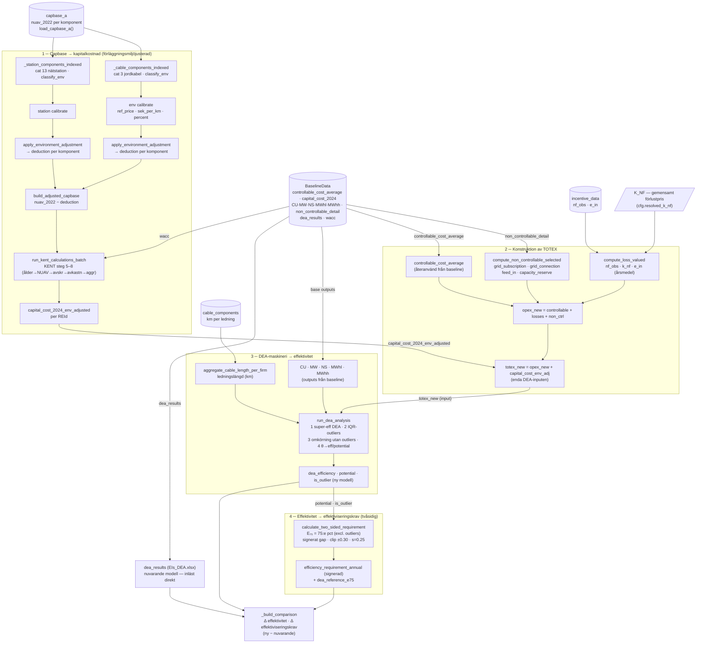

# New Benchmarking Add-on — beroendegraf & arkitektur

> **Syfte med detta dokument:** en karta över hur den nya benchmarkingmodellen
> hänger ihop, från capbase till effektiviseringskrav. Peka framtida
> Claude-konversationer hit innan de rör koden i `calculations/new_benchmarking/`.
> Alla fil- och radreferenser är relativa repo-roten och var korrekta när dokumentet
> skrevs — verifiera med `Read` innan du litar på en exakt rad.

---

## TL;DR

Add-on:en svarar på frågan **"hur påverkas företaget av Ei:s föreslagna nya
TOTEX-baserade DEA-modell, allt annat lika?"** Den är **frikopplad** från
case-/intäktsrams-pipelinen: den anropar `run_new_benchmarking()` direkt och bygger
aldrig en `CaseDefinition`.

- **Entrypoint:** `run_new_benchmarking(cfg)` i `calculations/new_benchmarking/model.py:87`
- **Retur:** `NewBenchmarkingResult` (frozen dataclass, `model.py:48`) — allt UI läser härifrån.
- **Allt-eller-inget-konfig:** `NewBenchmarkingConfig` (`config.py:48`). `cfg.signature()`
  är den stabila identiteten som används både som `@st.cache_data`-nyckel och som
  giltighetstoken för det förberäknade huvudspecet.
- **Jämförelsen** sker mot **nuvarande modell**, som läses *direkt* från Ei:s publicerade
  `EIs_DEA.xlsx` (företagets faktiska "föregående värden") — den räknas **inte** om.
  Endast den nya modellen kör en egen DEA-omgång.

Processen i fyra steg (de fyra blocken i grafen nedan):

1. **Capbase → kapitalkostnad** (förläggningsmiljöjusterad)
2. **Konstruktion av TOTEX**
3. **DEA-maskineri → effektivitet**
4. **Effektivitet → effektiviseringskrav**

---

## Filkarta — var ligger vad

### Add-on-paketet `calculations/new_benchmarking/`

| Fil | Roll |
|-----|------|
| `model.py` | Orkestrerare. `run_new_benchmarking()`, `NewBenchmarkingResult`, `_build_comparison()`, `_build_cable_outputs()`. |
| `config.py` | `NewBenchmarkingConfig` + alla reglage, defaultkategorier, `signature()`. |
| `opex_components.py` | OPEX-sidan: `compute_loss_valued()`, `compute_non_controllable_selected()`, `build_opex_components()`. |
| `capex_environment.py` | Capbase→kapitalkostnad: `compute_env_adjusted_capital_cost()`, `build_adjusted_capbase()`, `EnvCapexResult`. |
| `totex.py` | `build_totex()` — sätter ihop `opex_new` och `totex_new`. |
| `efficiency_requirement_two_sided.py` | `calculate_two_sided_requirement()` — signerat gap till `E₇₅`, tvåsidigt utfall (steg 4). |
| `cost_impact.py` | Effektiviseringskrav till kronor: `period_efficiency_amount()` (compounding som pipelinen), `build_cost_impact()`. Nuvarande på OPEX-bas, ny på full okorrigerad TOTEX-bas (steg 5). |
| `environment_capex_adjustment/` | Jordkabel (cat 3): `config.py`, `data.py` (`classify_env`), `calibration.py` (`calibrate`), `adjustment.py` (`apply_environment_adjustment`). |
| `station_capex_adjustment/` | Nätstation (cat 13): samma form som ovan, parallellt paket. |
| `cable_length/` | Ledningslängd (DEA-output): `load_cable_components()`, `aggregate_cable_length_per_firm()`. |

### Delade moduler den lutar sig mot (utanför paketet)

| Fil | Vad |
|-----|-----|
| `calculations/capex/kent_calculations.py` | `run_kent_calculations_batch()` — KENT steg 5–8 (capbase → `capital_cost_2024`). |
| `calculations/capex/wacc_calculations.py` | `BASELINE_WACC`. |
| `calculations/frontier/dea_calculations.py` | `run_dea_analysis()` — super-eff DEA + IQR-outliers. |
| `config/column_names.py` | Alla `COL_*`-konstanter (kolumnnamn är engelska). |
| `config/incentive_parameters.py` | `K_NF` (gemensamt förlustpris per år). |

### Runtime / förberäkning / frontend

| Fil | Vad |
|-----|-----|
| `scripts/precompute_new_benchmarking.py` | Förberäknar huvudspecet offline → `data/new_benchmarking/`. |
| `data_loaders/new_benchmarking_data.py` | `load_precomputed_main()` — rekonstruerar `NewBenchmarkingResult` vid körning. |
| `pages/5_new_benchmarking.py` | Streamlit-sidan. Tung DEA fyras bara på knappklick. |
| `frontend/modules/addons/new_benchmarking_spec.py` | `render_config_panel()` — experimentpanelen. |
| `frontend/results/new_benchmarking_output.py` | Resultatvyn (Sektoröversikt + Ditt företag + TOTEX-brygga). |
| `tests/.../test_new_benchmarking_precompute.py` | Vaktar att den committade bundeln inte driftat från live-beräkning. |

---

## Beroendegraf



---

## Datakällor (load boundary)

Alla laddas inom `run_new_benchmarking()` om de inte skickas in som argument
(`baseline_data`, `capbase` kan injiceras — förberäkningsskriptet och testerna gör det).

| Källa | Loader | Ger |
|-------|--------|-----|
| Capbase (komponentnivå) | `data_loaders/rab_data.py` → `load_capbase_a()` | `nuav_2022`, `cat_encode`, `count_comp`, enhetspris, techspec/volt per komponent. |
| Baseline | `data_loaders/baseline_data.py` → `load_baseline_data()` | `df_all_companies` (`controllable_cost_average`, `capital_cost_2024`, `CU/MW/NS/MWhl/MWhh`), `non_controllable_detail`, `dea_results` (nuvarande modell), `wacc`. |
| Incitament | `data_loaders/incentive_data.py` → `load_incentive_data()` | `nf_obs`, `e_in` per REId/år (för förlustvärdering). |
| Ledningar | `calculations/new_benchmarking/cable_length/` → `load_cable_components()` | km per ledning (för DEA-output ledningslängd). |
| Gemensamt förlustpris | `config/incentive_parameters.py` → `K_NF` | kr/MWh per år; default när `cfg.k_nf` är `None`. |

---

## Steg 1 — Capbase → kapitalkostnad

**Fil:** `calculations/new_benchmarking/capex_environment.py`
**Funktion:** `compute_env_adjusted_capital_cost(cfg, capbase, wacc)` (`capex_environment.py:147`)

Idé: förläggningsmiljökorrektionen nivellerar varje **jordkabel (cat_encode 3)** och
**nätstation (cat_encode 13)** ner till en referensmiljö ("landsbygd normal"). Eftersom
KENT-kapitalkostnaden är **linjär i `nuav_2022`** är det exakta sättet att föra korrektionen
hela vägen till kapitalkostnad:

1. Dra varje komponents `deduction` från dess `nuav_2022` i capbase
   (`build_adjusted_capbase`, `capex_environment.py:125`).
2. Kör **om hela KENT (steg 5–8)** på den korrigerade capbasen.

Korrektionen per komponent kommer från två parallella delpaket med identisk form:

- `environment_capex_adjustment/` (jordkabel) och `station_capex_adjustment/` (nätstation).
- Flöde per paket: `classify_env` (data.py) → `calibrate` (calibration.py) → `apply_environment_adjustment` (adjustment.py).
- `calibrate` bygger `ref_price` per (techspec × volt) som km-viktat landsbygd-normalpris,
  plus `sek_per_km` och `percent` per miljö.
- Tre metoder (väljs via `cfg.cable_method` / `cfg.station_method`): `exact`,
  `schablon_per_km`, `schablon_percent`. Default är `exact`.
- Deduktioner kapas till `[0, value]` (teckensäkert även för utrangeringar med negativt `value`).

**KENT (steg 5–8):** `calculations/capex/kent_calculations.py` →
`run_kent_calculations_batch(adjusted, wacc, return_detailed=False)` (`kent_calculations.py:22`):
- Steg 5: `calculate_ages_and_nuav_batch` — ålder, ordinarie/tail-klassning, `nuav_ord/tail`.
- Steg 6: `calculate_depreciation_batch` — avskrivningar.
- Steg 7: `calculate_returns_batch` — avkastning (använder `wacc`).
- Steg 8: `aggregate_to_network_level` + `calculate_capex_outputs` → `capital_cost_2024` per nät.

**Ut:** `EnvCapexResult.capital_cost` — `REId`, `capital_cost_2024_env_adjusted`
(plus diagnostik för kabel- och stationskorrektionen).

> **Obs:** om `cfg.include_capex=False` hoppas korrektionen över och KENT körs på
> *ojusterad* capbase (för att isolera OPEX-sidan), men kolumnen behåller `_env_adjusted`-namnet.

---

## Steg 2 — Konstruktion av TOTEX

**Filer:** `opex_components.py` (OPEX-delarna) + `totex.py` (sammansättning).

OPEX-sidan, `build_opex_components(cfg, non_controllable_detail, incentive_df)`
(`opex_components.py:85`):

- `compute_loss_valued` — nätförluster värderade till gemensamt pris:
  `loss = nf_obs · k_nf[year] · e_in / 1000`, medel över prognosåren (2024–2027).
- `compute_non_controllable_selected` — valda icke-påverkbara kategorier (default:
  `grid_subscription`, `grid_connection`, `feed_in_compensation`, `capacity_reserve`),
  negativ kostnad → positiv, medel över prognosåren.
- `regulatory_fees` är **alltid exkluderad**; `network_loss_*` ersätts av den gemensamma
  prisvärderingen ovan.

Sammansättning, `build_totex(cfg, baseline_df, opex_components, capital_cost)` (`totex.py:23`):

```
opex_new  = controllable_cost_average + loss_valued + non_controllable_selected
totex_new = opex_new + capital_cost_2024_env_adjusted
```

- `controllable_cost_average` **återanvänds från baseline** så ny och nuvarande modell
  delar exakt samma påverkbara siffra (äpplen-mot-äpplen).
- Varje delpost har en på/av-switch i `cfg` (`include_controllable/losses/capex` +
  `non_controllable_categories`); avstängd post bidrar med 0 så schemat är stabilt.
- `capital_cost_2024` (ojusterad) bärs med vid sidan om — UI:t använder den till
  TOTEX-bryggans waterfall (nuvarande → ny TOTEX).

**Ut:** `totex`-DataFrame, en rad per REId. `totex_new` är **den enda DEA-inputen**.

> **Känd förenkling (periodglapp):** `controllable_cost_average` är indexerat 2018–2021-medel,
> medan icke-påverkbara poster och `nf_obs/e_in` är 2024–2027-prognos. De kombineras som de
> är — speglar hur nuvarande modell mixar 2018–2021-OPEX med 2024 kapitalkostnad.

---

## Steg 3 — DEA-maskineri → effektivitet

**Var den byggs:** `model.py:112–126`. **DEA-motorn:**
`calculations/frontier/dea_calculations.py` → `run_dea_analysis(df, model_spec)`.

DEA-specen för nya modellen:

- **Input:** `[totex_new]` (en enda input).
- **Outputs:** basoutputs `CU, MW, NS, MWhl, MWhh` (från baseline) + ledningslängd om
  `cfg.include_cable_length` (default `True`).
- Ledningslängd byggs av `_build_cable_outputs(cfg)` (`model.py:61`) via
  `aggregate_cable_length_per_firm`; `cfg.split_by_voltage` ger en längd-output per
  spänningsnivå istället för en total.
- `rts = cfg.rts` (default `crs`), input-orienterad.

`run_dea_analysis` (`dea_calculations.py:20`) gör fyra steg:

1. Super-effektivitets-DEA på alla bolag (LP per bolag via PuLP/CBC).
2. Outlier-flaggning med IQR (`q_lower=25, q_upper=75, multiplier=2`; tröskel
   `Q3 + 2·IQR`).
3. Omkörning med outliers **borttagna ur referensmängden**.
4. `efficiency = min(θ,1)`, `potential = 1 − efficiency`, samt `is_outlier`
   (outliers får `potential = 1.0` och hanteras separat i steg 4).

**Ut:** `dea_new` — `REId`, `dea_efficiency`, `potential`, `is_outlier`.

---

## Steg 4 — Effektivitet → effektiviseringskrav (tvåsidig)

**Fil:** `calculations/new_benchmarking/efficiency_requirement_two_sided.py`
**Funktion:** `calculate_two_sided_requirement(dea_new, **cfg-fält)` (`model.py:126`)

Ei:s nya inriktning: referensen flyttas från **fronten** till **tredje kvartilen**, och
utfallet blir **signerat** (avdrag *eller* tillägg). Den gamla front-/endast-avdrag-metoden
(`calculations/efficiency/efficiency_requirement.py`) lever kvar — men bara i intäktsrams-
pipelinen (M5), inte här. Tolkning: `new_benchmarking_model/tolkning-overgang-effektiviseringsincitament.md`.

- `E₇₅` = 75:e percentilen av `dea_efficiency` (capped, `min(θ,1)`) **exklusive outliers**.
- Signerat gap `g = E₇₅ − E_i`, kapat symmetriskt till `[−0.30, +0.30]`.
  ```
  utfall_period = clip(E₇₅ − E_i, ±0.30) · sharing · (supervision_period / realization_time)
  årligt_utfall = (1 + utfall_period)^(1/supervision_period) − 1
  ```
  Default: `sharing=0.50`, `realization_time=8`, `supervision_period=4` → `s = 0.25`;
  max avdrag = **+1,82 %/år** (= legacy-taket), tillägg `< 0`.
- **Inget golv, ingen fast outlier-regel.** Full täckning vid `E₇₅` (gap 0). Outliers
  exkluderas ur percentilen men får ett utfall som vilket frontbolag som helst (capped till
  `E_i = 1.0` → samma belöning).

**Ut:** signerad kolumn `efficiency_requirement_annual` + konstant `dea_reference_e75` (`E₇₅`) på `dea_new`.

---

## Nuvarande modell & jämförelse

`model.py:128–136`:

- **Nuvarande modell** = `baseline_data.dea_results`, läst direkt ur `EIs_DEA.xlsx`
  (`dea_efficiency`, `potential`, `is_outlier`, `efficiency_requirement_annual`).
  **Ingen omräkning** — det är företagets faktiska "föregående värden".
- `_build_comparison(dea_new, dea_current)` (`model.py:150`) slår ihop ny vs nuvarande
  och beräknar `efficiency_delta` och `eff_req_delta` (ny − nuvarande).

---

## Steg 5 - Effektiviseringskrav till kronor

**Fil:** `calculations/new_benchmarking/cost_impact.py`. Procenten omvandlas till kronor
genom att appliceras på en kostnadsbas över den 4-åriga tillsynsperioden. De två modellerna
applicerar på **olika baser** (det är poängen med reformen, se
`docs/ei_to_markdown/outputs/tillampningsmetod-effektiviseringsincitament.md`):

- **Nuvarande modell:** OPEX-bas = `controllable_cost_average` + `neon/4`.
- **Nya modellen:** full **okorrigerad** TOTEX = controllable + neon/4 + faktiska nätförluster
  (`network_loss_purchased + network_loss_own_production`) + valda icke-påverkbara +
  okorrigerad kapitalkostnad (`capcost_a.capcost_network / 4`, periodsumma 2024-2027).

Benchmarking-korrektionerna (gemensamt förlustpris, förläggningsmiljöjusterad capex) sätter
**procenten** men aldrig **kronbasen** (Ei: incitamentet tillämpas på de okorrigerade värdena).

`period_efficiency_amount(eff, årsbas)` återanvänder pipelinens compounding-mekanik exakt
(`eff × årsbas × (1+eff)^(t-1)`, summerat över 4 år), verifierat byte-för-byte mot
`calculations/opex/controllable_cost_calculations.py` i testet. `build_cost_impact()` merger
in baserna och de två periodsummorna i `totex`-framen: `COL_OPEX_BASE_CURRENT`,
`COL_APPLICATION_BASE_NEW`, `COL_KR_CURRENT`, `COL_KR_NEW`.

> **Huvudinsikt:** eftersom nya procenten slår på en mycket större bas kan utfallet *falla i
> procent men stiga i kronor*, sant för ~52 % av bolagen. UI:t färgar därför verdikten på
> kr-swingen och förklarar divergensen i text.

---

## `NewBenchmarkingConfig` — reglagen (`config.py:48`)

| Fält | Default | Effekt |
|------|---------|--------|
| `k_nf` | `None` → `K_NF` | Gemensamt förlustpris per år. |
| `include_controllable` / `include_losses` / `include_capex` | `True` | På/av per TOTEX-delpost. |
| `non_controllable_categories` | grid_subscription, grid_connection, feed_in, capacity_reserve | Vilka icke-påverkbara poster som ingår (`regulatory_fees` aldrig). |
| `cable_method` / `station_method` | `exact` | Förläggningsmiljömetod. |
| `cable_override_percent` / `station_override_percent` | `None` | Ersätter kalibrerade procent (t.ex. Ei:s publicerade). |
| `include_cable_length` | `True` | Lägg ledningslängd som DEA-output. |
| `cable_types` | `ELECTRICAL_TYPES` | Vilka ledningstyper (exkl. optokabel). |
| `split_by_voltage` | `False` | En längd-output per spänningsnivå. |
| `rts` | `crs` | DEA returns-to-scale. |
| `new_base_outputs` | CU, MW, NS, MWhl, MWhh | DEA-basoutputs. |
| `reference_percentile` / `gap_cap` / `sharing` / `realization_time` / `supervision_period` | 75 / 0.30 / 0.50 / 8 / 4 | Tvåsidiga kravparametrar (steg 4); `s = sharing · 4/8 = 0.25`. |

`cfg.signature()` (`config.py:88`) är den stabila, hashbara identiteten. Två configs med
samma signatur ger samma `NewBenchmarkingResult` → används som cache-nyckel **och** som
giltighetstoken för den förberäknade bundeln. `repr(signature())` är formen på disk.

---

## Förberäkning & cache

Huvudspecet (`NewBenchmarkingConfig()`) är dyrt (148-bolags KENT-omkörning + DEA) men
identiskt för alla användare, och `@st.cache_data` nollställs vid varje omdeploy. Därför:

- Förberäknas offline med `scripts/precompute_new_benchmarking.py` → `data/new_benchmarking/`.
- Laddas vid körning via `data_loaders/new_benchmarking_data.py` → `load_precomputed_main()`,
  som rekonstruerar `NewBenchmarkingResult`.
- Vaktas av config-signatur-token + `test_new_benchmarking_precompute.py` (kör om live och
  faller om den committade bundeln driftat).
- **Endast** defaultspecet förberäknas; experimentpanelens justeringar körs live (cachas per signatur).

> **Kör om skriptet** närhelst huvudspecet, beräkningskoden eller källdatan ändras.

---

## Viktiga konventioner & fallgropar

- **Add-on:en är frikopplad** från case-pipelinen — bygg aldrig en `CaseDefinition` här.
- **Nuvarande modell räknas inte om** — den läses direkt ur `EIs_DEA.xlsx`. Endast nya
  modellen kör DEA.
- **KENT är linjär i `nuav_2022`** — det är därför förläggningsmiljökorrektionen kan göras
  som en avdragspost på capbasen följt av en ren omkörning.
- **Avstängd TOTEX-delpost bidrar med 0**, inte med en saknad kolumn — schemat hålls stabilt.
- **Alla kostnadssiffror är årliga, i tkr.** Kolumnnamn är engelska `COL_*` från
  `config/column_names.py`; svenska kolumnnamn finns bara i `data_loaders/`.
- **`calculations/` är ren logik** — inga Streamlit-/UI-importer.
- Efter ändringar i `calculations/`, `pipeline/` eller `data_loaders/`: kör
  `./venv/Scripts/python.exe -m pytest tests/ -v`.

---

## Snabb spårning vid felsökning

| Symptom | Titta först i |
|---------|---------------|
| Fel/oväntad TOTEX-nivå | `totex.py` (switchar), `opex_components.py` (förlust/icke-påverkbar), `capex_environment.py` (capex). |
| Fel kapitalkostnad | `capex_environment.py` (deduktioner) → `kent_calculations.py` (steg 5–8). |
| Fel/avvikande effektivitet | `model.py:112–126` (DEA-spec), `dea_calculations.py` (motor, outliers). |
| Fel effektiviseringskrav | `efficiency_requirement_two_sided.py` (`E₇₅`/gap/clip), `cfg.gap_cap` m.fl. |
| Fel kr-belopp / fel bas | `cost_impact.py` (baserna, `period_efficiency_amount`); jämför mot pipelinens `controllable_cost_calculations.py`. |
| Resultat ändras inte trots ny config | Cache/förberäkning: `signature()`, `load_precomputed_main()`, kör om precompute-skriptet. |
